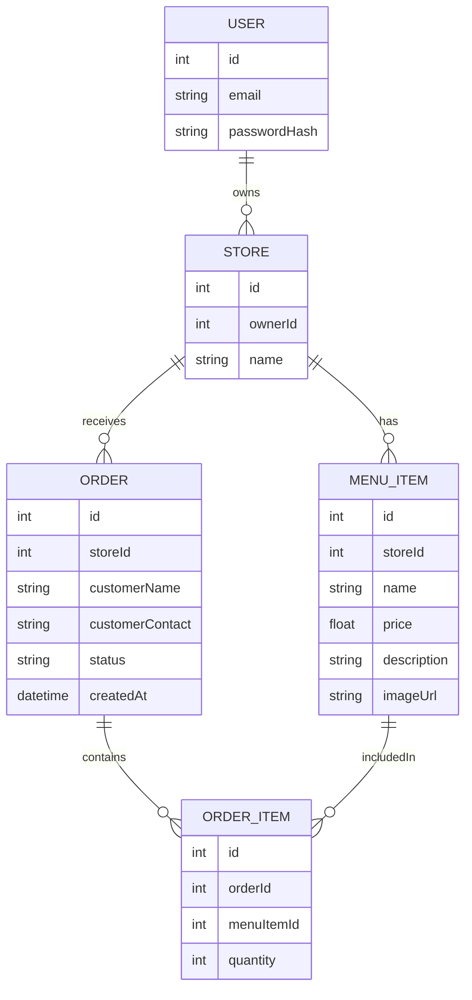

# Database Schema

_What are the main entities and relationships in your data model?_

---

## ER Diagram

<small>(This diagram covers all user stories for MVP and is easily extensible.)</small>

---

## Entities

### User
- **id**: int, auto-increment  
  <small>(Primary key, unique identifier.)</small>
- **email**: string, unique  
  <small>(Store owner's email for login.)</small>
- **passwordHash**: string  
  <small>(Hashed password for authentication.)</small>

### Store
- **id**: int, auto-increment  
  <small>(Primary key.)</small>
- **ownerId**: int, foreign key → User.id  
  <small>(Links the store to its owner.)</small>
- **name**: string  
  <small>(Store name.)</small>

### MenuItem
- **id**: int, auto-increment  
  <small>(Primary key.)</small>
- **storeId**: int, foreign key → Store.id  
  <small>(Menu item belongs to a store.)</small>
- **name**: string  
  <small>(Item name.)</small>
- **price**: float  
  <small>(Item price.)</small>
- **description**: string  
  <small>(Item description.)</small>
- **imageUrl**: string  
  <small>((Optional) Image for menu item.)</small>

### Order
- **id**: int, auto-increment  
  <small>(Primary key.)</small>
- **storeId**: int, foreign key → Store.id  
  <small>(Order placed at a store.)</small>
- **customerName**: string  
  <small>(Name of customer placing the order.)</small>
- **customerContact**: string  
  <small>(Contact info for notifications.)</small>
- **status**: string (enum: pending, confirmed, declined)  
  <small>(Order status.)</small>
- **createdAt**: datetime  
  <small>(Order creation timestamp.)</small>

### OrderItem
- **id**: int, auto-increment  
  <small>(Primary key.)</small>
- **orderId**: int, foreign key → Order.id  
  <small>(Order this item belongs to.)</small>
- **menuItemId**: int, foreign key → MenuItem.id  
  <small>(Menu item being ordered.)</small>
- **quantity**: int  
  <small>(How many of this menu item in the order.)</small>

---

## Relationships

- One **User** owns one or more **Stores**.
- Each **Store** has many **MenuItems** and **Orders**.
- Each **Order** contains one or more **OrderItems**.
- Each **OrderItem** references a **MenuItem**.

---

<small>This schema is designed for MVP scope but easily supports future extensions (e.g., customer accounts, payments, multi-store owners).</small>